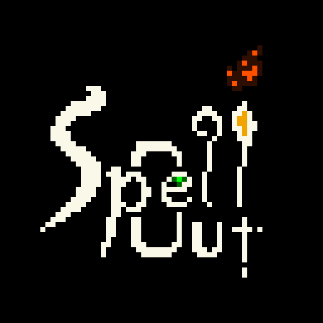

#  Spell Out

- マウス操作のアクションシューティング
- ステージ制
- 5つの属性と属性ごとの攻撃・スキル
- 属性の相性によってダメージ量が変化
- (みかわし) *todo*  
詳しい操作方法などは、[how-to.md](how-to.md) を見てね  

## 使用アセット
- 言語 : [Ruby](https://www.ruby-lang.org/ja/)
- ライブラリ : [DXRuby](http://dxruby.osdn.jp/)
- 音源  
    [魔王魂様](https://maoudamashii.jokersounds.com/)  
    [Tallbeard Studios様](https://tallbeard.itch.io/music-loop-bundle)
- 画像  
    [ヌー様](http://damagedgold.wp.xdomain.jp/2016/03/25/link/)  
    [尾羽の小屋様](http://obane.tuzikaze.com/)
- フォント  
    [jeti様](https://fontmeme.com/jfont/poco-font/)
    

## 開発ツール & リンク集
- vscode ext  
  Project Links (https://marketplace.visualstudio.com/items?itemName=KyleDavidE.vscode-project-links)  
  endwise (https://marketplace.visualstudio.com/items?itemName=kaiwood.endwise)  
  Ruby Solargraph (https://marketplace.visualstudio.com/items?itemName=castwide.solargraph)  
- DXRuby API Reference (http://mirichi.github.io/dxruby-doc/api/index.html)  
